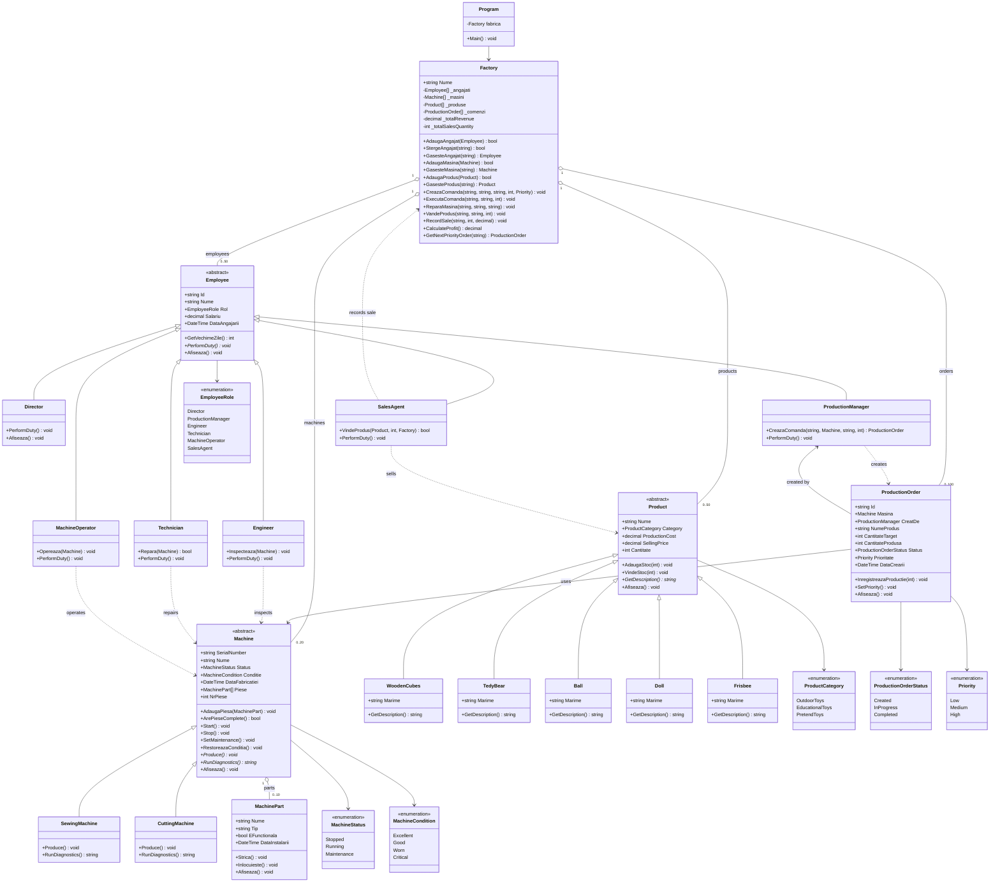

# Smart Factory UML Diagram

```mermaid
classDiagram
    class Program {
        -Factory fabrica
        +Main() void
    }

    class Factory {
        +string Nume
        -Employee[] _angajati
        -Machine[] _masini
        -Product[] _produse
        -ProductionOrder[] _comenzi
        -decimal _totalRevenue
        -int _totalSalesQuantity
        +AdaugaAngajat(Employee) bool
        +StergeAngajat(string) bool
        +GasesteAngajat(string) Employee
        +AdaugaMasina(Machine) bool
        +GasesteMasina(string) Machine
        +AdaugaProdus(Product) bool
        +GasesteProdus(string) Product
        +CreazaComanda(string, string, string, int, Priority) void
        +ExecutaComanda(string, string, int) void
        +ReparaMasina(string, string, string) void
        +VandeProdus(string, string, int) void
        +RecordSale(string, int, decimal) void
        +CalculateProfit() decimal
        +GetNextPriorityOrder(string) ProductionOrder
    }

    class Employee {
        <<abstract>>
        +string Id
        +string Nume
        +EmployeeRole Rol
        +decimal Salariu
        +DateTime DataAngajarii
        +GetVechimeZile() int
        +PerformDuty()* void
        +Afiseaza() void
    }

    class Director {
        +PerformDuty() void
        +Afiseaza() void
    }

    class ProductionManager {
        +CreazaComanda(string, Machine, string, int) ProductionOrder
        +PerformDuty() void
    }

    class Engineer {
        +Inspecteaza(Machine) void
        +PerformDuty() void
    }

    class Technician {
        +Repara(Machine) bool
        +PerformDuty() void
    }

    class MachineOperator {
        +Opereaza(Machine) void
        +PerformDuty() void
    }

    class SalesAgent {
        +VindeProdus(Product, int, Factory) bool
        +PerformDuty() void
    }

    class Machine {
        <<abstract>>
        +string SerialNumber
        +string Nume
        +MachineStatus Status
        +MachineCondition Conditie
        +DateTime DataFabricatiei
        +MachinePart[] Piese
        +int NrPiese
        +AdaugaPiesa(MachinePart) void
        +ArePieseComplete() bool
        +Start() void
        +Stop() void
        +SetMaintenance() void
        +RestoreazaConditia() void
        +Produce()* void
        +RunDiagnostics()* string
        +Afiseaza() void
    }

    class SewingMachine {
        +Produce() void
        +RunDiagnostics() string
    }

    class CuttingMachine {
        +Produce() void
        +RunDiagnostics() string
    }

    class MachinePart {
        +string Nume
        +string Tip
        +bool EFunctionala
        +DateTime DataInstalarii
        +Strica() void
        +Inlocuieste() void
        +Afiseaza() void
    }

    class Product {
        <<abstract>>
        +string Nume
        +ProductCategory Category
        +decimal ProductionCost
        +decimal SellingPrice
        +int Cantitate
        +AdaugaStoc(int) void
        +VindeStoc(int) void
        +GetDescription()* string
        +Afiseaza() void
    }

    class WoodenCubes {
        +string Marime
        +GetDescription() string
    }

    class TedyBear {
        +string Marime
        +GetDescription() string
    }

    class Ball {
        +string Marime
        +GetDescription() string
    }

    class Doll {
        +string Marime
        +GetDescription() string
    }

    class Frisbee {
        +string Marime
        +GetDescription() string
    }

    class ProductionOrder {
        +string Id
        +Machine Masina
        +ProductionManager CreatDe
        +string NumeProdus
        +int CantitateTarget
        +int CantitateProdusa
        +ProductionOrderStatus Status
        +Priority Prioritate
        +DateTime DataCrearii
        +InregistreazaProductie(int) void
        +SetPriority() void
        +Afiseaza() void
    }

    class ProductCategory {
        <<enumeration>>
        OutdoorToys
        EducationalToys
        PretendToys
    }

    class MachineStatus {
        <<enumeration>>
        Stopped
        Running
        Maintenance
    }

    class MachineCondition {
        <<enumeration>>
        Excellent
        Good
        Worn
        Critical
    }

    class EmployeeRole {
        <<enumeration>>
        Director
        ProductionManager
        Engineer
        Technician
        MachineOperator
        SalesAgent
    }

    class ProductionOrderStatus {
        <<enumeration>>
        Created
        InProgress
        Completed
    }

    class Priority {
        <<enumeration>>
        Low
        Medium
        High
    }

    Program --> Factory

    Factory "1" o-- "0..50" Employee : employees
    Factory "1" o-- "0..20" Machine : machines
    Factory "1" o-- "0..50" Product : products
    Factory "1" o-- "0..100" ProductionOrder : orders

    Employee <|-- Director
    Employee <|-- ProductionManager
    Employee <|-- Engineer
    Employee <|-- Technician
    Employee <|-- MachineOperator
    Employee <|-- SalesAgent
    Employee --> EmployeeRole

    Machine <|-- SewingMachine
    Machine <|-- CuttingMachine
    Machine "1" o-- "0..10" MachinePart : parts
    Machine --> MachineStatus
    Machine --> MachineCondition

    Product <|-- WoodenCubes
    Product <|-- TedyBear
    Product <|-- Ball
    Product <|-- Doll
    Product <|-- Frisbee
    Product --> ProductCategory

    ProductionOrder --> Machine : uses
    ProductionOrder --> ProductionManager : created by
    ProductionOrder --> ProductionOrderStatus
    ProductionOrder --> Priority

    ProductionManager ..> ProductionOrder : creates
    Engineer ..> Machine : inspects
    Technician ..> Machine : repairs
    MachineOperator ..> Machine : operates
    SalesAgent ..> Product : sells
    SalesAgent ..> Factory : records sale
```
